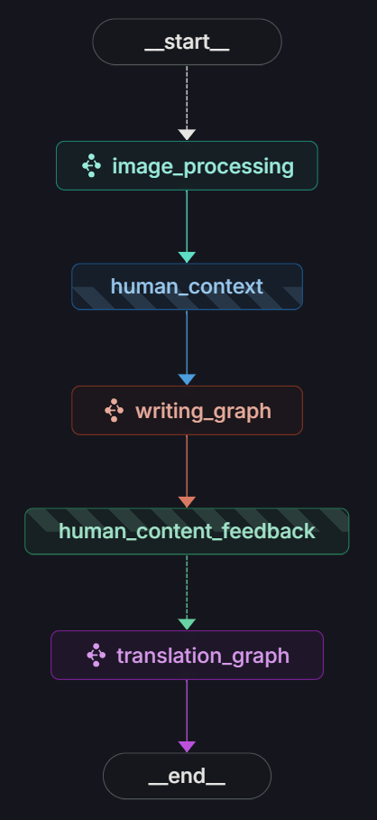
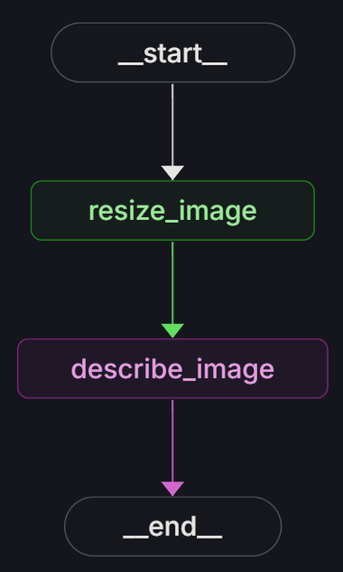
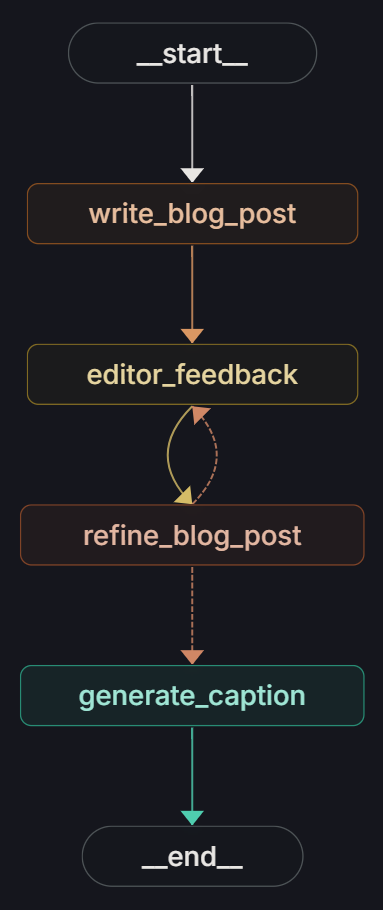
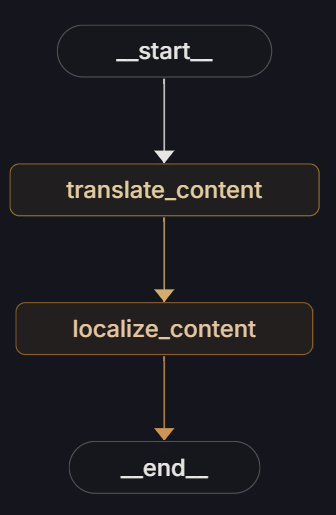

# pictopost

## LangGraph Blog Generator

This project is a multi-stage, modular AI pipeline built with LangGraph and LLMs, enabling users to generate rich, multilingual blog posts from images with minimal human intervention.

### Features

1. **Image Processing**: Resize images and generate image descriptions.

2. **Blog Writing & Refinement**: Write, edit, and refine blog content.

3. **Social Media Captioning**: Create social media captions automatically.

4. **Translation & Localization**: Translate and localize blog content and captions.

5. **Composable Workflow Graphs**: Use LangGraph StateGraph with nodes and subgraphs.

6. **Checkpointing & Memory**: Save state and interrupt flows to allow human-in-the-loop interactions.

### Core Workflow Graphs

This project defines three main LangGraph StateGraph workflows, each with nodes and logic edges:

1. **Main Graph** 

    - Orchestrates the entire pipeline:

        - Starts image processing (initiate_image_processing)

        - Human provides additional context (human_context)

        - Blog writing and editing (writing_graph)

        - Human chooses target language

        - Translation and localization (translation_graph)

    - Uses MemorySaver checkpointing to allow resuming and human interruptions.

    - Transitions between subgraphs using conditional and regular edges.

2. **Image Processing Subgraph** 

    - Nodes:

        - resize_image: Resizes images proportionally.

        - describe_image: Generates textual descriptions using an LLM.

3. **Writing Subgraph**

    - Nodes:

        - write_blog_post: Generates initial blog content.

        - editor_feedback: Gets editorial feedback.

        - refine_blog_post: Refines content based on feedback.

        - generate_caption: Creates social media captions.

4. **Translation Subgraph**

    - Nodes:

        - translate_content: Translates content into a target language.

        - localize_content: Adjusts content for regional/cultural localization.

